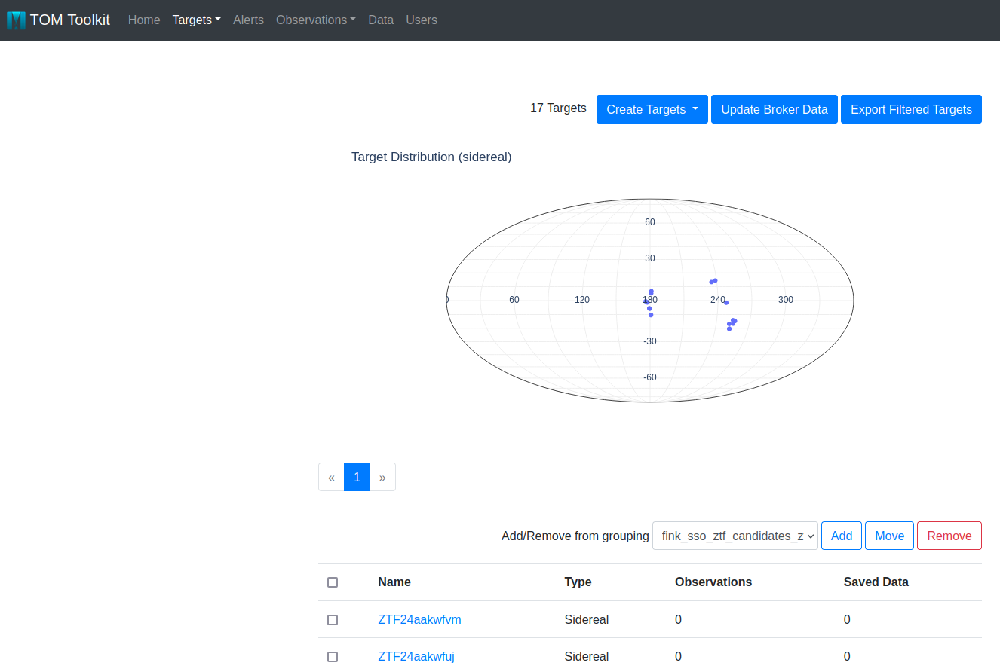

# Fink Alert Broker Module for the TOM Toolkit

[](https://pypi.python.org/pypi/tom-fink)
[](https://www.codacy.com/gh/TOMToolkit/tom_fink/dashboard?utm_source=github.com&amp;utm_medium=referral&amp;utm_content=TOMToolkit/tom_fink&amp;utm_campaign=Badge_Grade)
[](https://coveralls.io/github/TOMToolkit/tom_fink?branch=main)

This repository hosts the Fink Alert Broker Module for the TOM Toolkit. Fink is a broker currently connected to ZTF, and that will handle the massive alert stream from LSST. More information on Fink at https://fink-broker.org/. You can easily install the module using pip:

```bash
pip install tom-fink
```

## Polling data from the REST API

As of `tom-fink` version 0.4, the module simply uses the [Fink REST API](https://fink-broker.readthedocs.io/en/latest/services/science_portal/) to retrieve alerts. Note that the Fink databases are updated **once a day** with the previous night alert data (hence you do not get live alerts for the moment). Users can perform:
- Search by ZTF object ID
- Cone Search
- Search by derived alert class
- Search by Solar System name

You need to declare the `FinkBroker` class in your running TOM instance. To do so just add `tom_fink.fink.FinkBroker` to the `TOM_ALERT_CLASSES` in your TOM's `settings.py`:

```python
TOM_ALERT_CLASSES = [
  'tom_alerts.brokers.alerce.ALeRCEBroker',
  ...,
  'tom_fink.fink.FinkBroker'
]
```

and finally relaunch your TOM:

```bash
./manage.py runserver
```

## Polling data from the Fink livestream service

Alternatively from `tom_fink` version 0.6.0, users can poll Fink substreams in real-time, using the [livestream service](https://fink-broker.readthedocs.io/en/latest/services/livestream/). First you need to add `tom_alertstreams` and `tom_fink` to your `INSTALLED_APPS` setting in your project `settings.py`:

```python
INSTALLED_APPS = [
    ...
    'tom_alertstreams',
    'tom_fink'
]
```

Then add the following block to your `settings.py`:

```python
ALERT_STREAMS = [
    {
        'ACTIVE': True,
        'NAME': 'tom_fink.alertstream.FinkAlertStream',
        'OPTIONS': {
            'URL': os.getenv('FINK_CREDENTIAL_URL', 'set FINK_CREDENTIAL_URL value in environment'),
            'USERNAME': os.getenv('FINK_CREDENTIAL_USERNAME', 'set FINK_CREDENTIAL_USERNAME value in environment'),
            'GROUP_ID': os.getenv('FINK_CREDENTIAL_GROUP_ID', 'set FINK_CREDENTIAL_GROUP_ID value in environment'),
            'TOPIC': os.getenv('FINK_TOPIC', 'set FINK_TOPIC value in environment'),
            'MAX_POLL_NUMBER': os.getenv("FINK_MAX_POLL_NUMBER", 1e10),
            'TIMEOUT': os.getenv('FINK_TIMEOUT', 10),
            'TOPIC_HANDLERS': {
                'fink.stream': 'tom_fink.alertstream.alert_logger',
            },
        },
    },
]
```

and declare the following variables in your `~/.bash_profile`:

```bash
export FINK_CREDENTIAL_USERNAME= # provided when registering to Fink livestream
export FINK_CREDENTIAL_GROUP_ID= # provided when registering to Fink livestream
export FINK_CREDENTIAL_URL= # provided when registering to Fink livestream
export FINK_TOPIC= # str, topic name to poll
export FINK_MAX_POLL_NUMBER= # int, number maximum of alerts to poll before closing the connection. Default is 1e10 (never stops).
export FINK_TIMEOUT= # int, in seconds. Default is 10 seconds if not set
```

Credentials are provided when registering to Fink livestream (see https://fink-broker.readthedocs.io/en/latest/services/livestream). The available topic names and description can be found at https://fink-broker.readthedocs.io/en/latest/services/livestream. Note that we currently allow to poll only one topic at once (multi-topic is planned for later). Then launch the `readstreams` service:

```bash
./manage.py readstreams
```

You should see a log similar to:

```bash
registering new views: args: ('groups', <class 'tom_common.api_views.GroupViewSet'>, 'groups'), kwargs: {}
registering new views: args: ('targets', <class 'tom_targets.api_views.TargetViewSet'>, 'targets'), kwargs: {}
registering new views: args: ('targetextra', <class 'tom_targets.api_views.TargetExtraViewSet'>, 'targetextra'), kwargs: {}
registering new views: args: ('targetname', <class 'tom_targets.api_views.TargetNameViewSet'>, 'targetname'), kwargs: {}
registering new views: args: ('targetlist', <class 'tom_targets.api_views.TargetListViewSet'>, 'targetlist'), kwargs: {}
registering new views: args: ('observations', <class 'tom_observations.api_views.ObservationRecordViewSet'>, 'observations'), kwargs: {}
registering new views: args: ('dataproducts', <class 'tom_dataproducts.api_views.DataProductViewSet'>, 'dataproducts'), kwargs: {}
registering new views: args: ('reduceddatums', <class 'tom_dataproducts.api_views.ReducedDatumViewSet'>, 'reduceddatums'), kwargs: {}
NumExpr defaulting to 8 threads.
FinkAlertStream.listen opening stream: IP:PORT with group_id: julien6 (call number: 0)
read_streams FinkAlertStream TID=378166 ; thread identifier=125271444649536
readstreams Command.handle() returning...
fink.alert_logger topic: fink_sso_ztf_candidates_ztf
fink.alert_logger value: ZTF24aakwfsz emitted 2024-04-23 07:26:57.998412 (received 2024-04-29 10:45:01)
FinkAlertStream.listen opening stream: IP:PORT with group_id: julien6 (call number: 1)
fink.alert_logger topic: fink_sso_ztf_candidates_ztf
fink.alert_logger value: ZTF24aakwftv emitted 2024-04-23 07:27:39.003823 (received 2024-04-29 10:45:01)
...
```

Each new alert will be saved as a `Target`. If more than one alert with the name `objectId` are emitted, you will be warned:

```bash
fink.alert_logger value: ZTF24aakwfsu emitted 2024-04-23 07:26:57.998412 (received 2024-04-29 08:18:07)
Target ZTF24aakwfsu already in the database
```

and the program will continue. Probably we should group these in the future, instead of ignoring subsequent alerts. Then launch the app (do not close the previous process!):

```bash
./manage.py runserver
```

and you should have access to your targets, that are accessible from their topic name:



### Testing & debugging the connection

Before running in production, we advise to make tests using a test stream, and polling a few alerts:

```bash
export FINK_CREDENTIAL_USERNAME= # provided when registering to Fink livestream
export FINK_CREDENTIAL_GROUP_ID= # provided when registering to Fink livestream
export FINK_CREDENTIAL_URL= # provided when registering to Fink livestream
export FINK_TOPIC=fink_sso_ztf_candidates_ztf
export FINK_MAX_POLL_NUMBER=2
export FINK_TIMEOUT=10
```

This way, you will poll alerts two-by-two, and you will have a reservoir of thousands of alerts (solar system objects)!

## Todo list

- [ ] Add a test suite (preferably running on GitHub Actions)
- [x] Add a linter (preferably running on GitHub Actions)
- [x] Update the Query Form with all API features
- [x] Enable querying live streams using the Fink Kafka client
- [x] Update visualisation of targets from the livestream service
